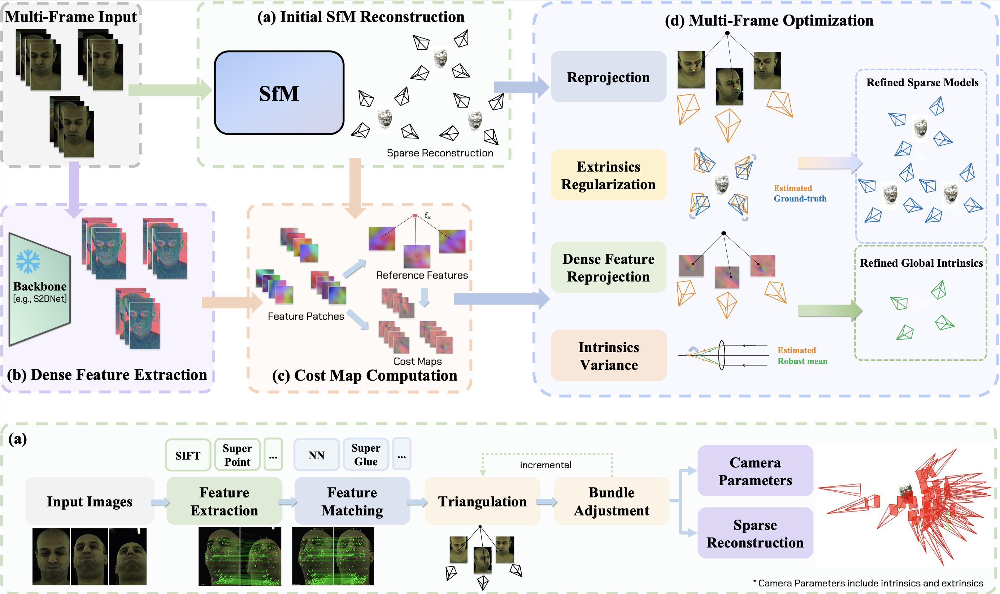
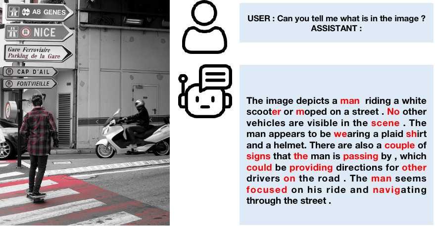
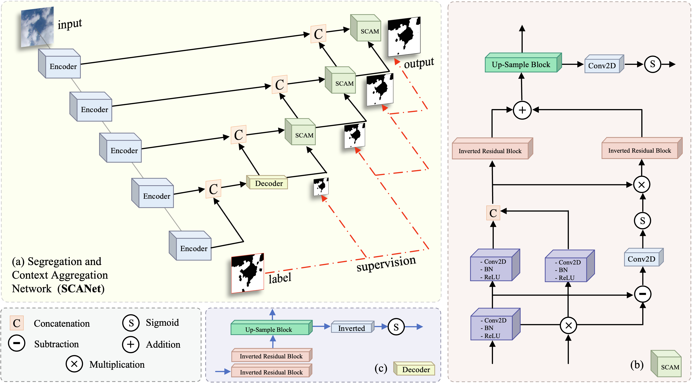
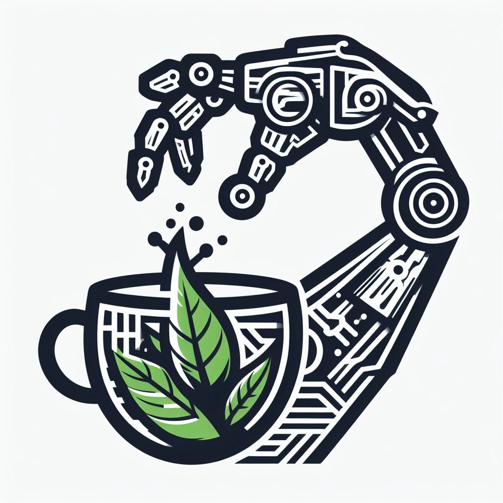
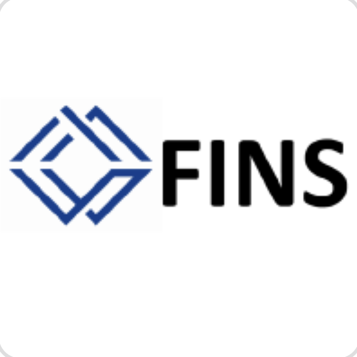








My name is Jiayi Zhang (张珈译), a Mathematics and Applied Mathmatics Undergrad student at University of Nottingham Ningbo China ([UNNC]([https://www.ucla.edu/](https://www.nottingham.edu.cn/en/index.aspx))). 

I am open to any relavant research collaboration and internship. 🥳 Feel free to contact me via <a href="mailto:smyjz19@nottingham.edu.cn">Email</a> or <a href="https://ZhangJiayi24.github.io/images/Wechat.png">WeChat</a>. 

Anyways, if I am not in the lab you can probably find me running along the Yuanshi Park, taking a walk back home in Tianjin, or playing board games. I also enjoy drawing inspiration from great engineers and inventors such as Raffaello D’Andrea (Kiva Systems and Verity’s autonomous drones), and from literary rule-breakers like Hermann Hesse and James Joyce.

📄 You can download my CV <a href="assets/files/Jiayi_Zhang_Resume.pdf" style="color: #0066cc; text-decoration: underline;" target="_blank">here</a>.

<!-- Previously, I spent a wonderful summer at Emory University, supervised by [Wei Jin](https://scholar.google.com/citations?user=eWow24EAAAAJ&hl=en&oi=ao), [Carl Yang](https://scholar.google.com/citations?user=mOINlwcAAAAJ&hl=en&oi=ao) 
and collaborated with [B. Aditya Prakash](https://scholar.google.com/citations?user=C-NftTgAAAAJ). -->

<!--

 

Previously, I spent a wonderful summer at Emory University, supervised by [Wei Jin](https://scholar.google.com/citations?user=eWow24EAAAAJ&hl=en&oi=ao), [Carl Yang](https://scholar.google.com/citations?user=mOINlwcAAAAJ&hl=en&oi=ao) 
and collaborated with [B. Aditya Prakash](https://scholar.google.com/citations?user=C-NftTgAAAAJ).

 

-->

 <strong style="color: red">🌟 📢 Seeking Remote Intern/Assistant (RA) Opportunity</strong> 
I am looking for research opportunities in 26Fall related to robotics and embodied intelligence, especially in labs based in the United States that support remote collaboration or on-site summer research. I am passionate about developing efficient and intelligent systems that connect decision-making, control, and real-world interaction. My current research interests include robotic manipulation and reinforcement learning for control. If our research interests align, please feel free to contact me via <a href="mailto:smyjz19@nottingham.edu.cn">Email</a> or <a href="https://ZhangJiayi24.github.io/images/Wechat.png">WeChat</a>.

# 🔎 Research 
<!-- "All things are interconnected, this is the essence of nature."  -->

<!-- <dt style="text-align: center; margin: 0; padding: 0;"> -->
<!--  -->
<!-- </dt> -->

I focus on developing efficient and intelligent systems that integrate learning and control for perception, reasoning, and real-world interaction. My current research interests focus on three key areas:

a) Robotics Manipulation: Perception-aware policy learning and generalizable control for physical interaction 

b) Control-oriented Reinforcement Learning: Offline or online methods for continuous control and real-world decision making

c) Large Model Inference Acceleration: Efficient architectures and optimization strategies for fast reasoning with foundation models

I support <a href="http://slow-science.org/" style="color: #0066cc; text-decoration: underline;" target="_blank">Slow Science</a>.

# 🔥 News

<ul style="list-style-type: none; padding-left: 0; margin: 0;">
 <li><em>2025.10:</em> 🎈 Great honor to have the opportunity to be a research assistant at the <strong>TEA lab</strong> at the <strong>Tsinghua University</strong>！</li>
 <li><em>2025.09:</em> 🎉 One our work was accepted by <strong>NeurIPS 2025 Embodied World Models Workshop.</strong> Congrats to Haidong!</li>
 <li><em>2025.09:</em>  I serve as a reviewer for <strong>NeurIPS 2025 Efficient Reasoning Workshop</strong>. </li>
 <li><em>2025.09:</em>  I serve as a semester peer mentor for 25-26 academic year for 2025 intake at UNNC.</li>
 <li><em>2025.08:</em> I serve as a reviewer for <strong>AAAI 2026</strong>.</li> 
<li><em>2025.06:</em> 🎈 Great honor to have the opportunity to be a research assistant at the <strong>IWIN-FINS lab</strong> at the <strong>Shanghai Jiao Tong University.</strong> </li>
<li><em>2025.06:</em> 🎉 Our paper: Multi-Cali Anything was selected as an <strong class="co-first">Oral Presentation</strong> at <strong>IROS 2025</strong>. See you in Hangzhou.</li>
<li><em>2025.06:</em> 🎉 Our work: Spec-LLaVA was accepted by <strong>ICML 2025 TTODLer-FM Workshop</strong>. See you in Vancouver.</li>
<li><em>2025.05:</em> 🥈 We got Honorable Mention (Second Prize) in ICM 2025! Congrads and thanks to my teammates!</li>
<li><em>2025.05:</em> I serve as a reviewer for <strong>EMNLP 2025</strong>.</li> 
<li><em>2025.04:</em>  I serve as a reviewer for <strong>NeurIPS 2025</strong>. </li>
<li><em>2025.04:</em> 🌐 My personal academic homepage is now online.</li>
<li><em>2025.03:</em> 🎈 Great honor to have the opportunity to be a research intern at the <strong>IoT lab</strong> at <strong>The University of Hong Kong.</strong> </li>
<li><em>2025.03:</em> 🎉 Our work: SCANet was accepted by <strong>ICLR 2025 Tackling Climate Change with Machine Learning Workshop</strong>. See you in Singapore.</li>
<li><em>2025.01:</em> I completed two additional AI4S articles during the machine learning process.</li>
<li><em>2025.01:</em> I participated in The Interdisciplinary Contest in Modeling (ICM).</li>
<li><em>2024.11:</em> I participated in writing a paper for the first time and began studying machine learning.</li>
</ul>

 

<!-- 

# 📝 Manuscripts

<dl>
 <dt>
Under Review
</dt>
 <dd><a href=""><strong>MOTION: Multi-Sculpt Evolutionary Coarsening for Federated Continual Graph Learning</strong></a></dd>
<dd>under review, 2025</dd>
</dl>

<dl>
 <dt>
Under Review
</dt>
 <dd><a href=""><strong>HYPERION: Fine-Grained Hypersphere Alignment for Robust Federated Graph Learning</strong></a></dd>
<dd>under review, 2025</dd>
</dl>

<dl>
 <dt>
Under Review
</dt>
 <dd><a href=""><strong>Multi-order Orchestrated Curriculum Distillation for Model-Heterogeneous Federated Graph Learning</strong></a></dd>
<dd>under review, 2025</dd>
</dl>

<dl>
 <dt>
Under Review
</dt>
 <dd><a href=""><strong>OASIS: One-Shot Federated Graph Learning via Wasserstein Assisted Knowledge Integration</strong></a></dd>
<dd>under review, 2025</dd>
</dl>

 -->

# 📃 Selected Publications ([Full List](https://scholar.google.com/citations?hl=en&user=bLUpHDsAAAAJ))

**&dagger; Equal Contribution**   

2025 

<dl>
<dt>
IROS 2025
</dt>
<dd><a href="https://wanghewei16.github.io/Multi-Cali-Anything/"><strong>Multi‑Cali Anything: Dense Feature Multi‑Frame Structure‑from‑Motion for Large‑Scale Camera Array Calibration</strong></a></dd>
<dd>Jinjiang You&dagger;, Hewei Wang&dagger;, Yijie Li, Mingxiao Huo, Long Van Tran Ha, Mingyuan Ma, Jinfeng Xu, <strong>Jiayi Zhang</strong>, Puzhen Wu, Shubham Garg, Wei Pu</dd>
<dd>  <strong class="co-first"><i>Oral Presentation</i></strong> in International Conference on Intelligent Robots and Systems (<strong>IROS</strong>), 2025</dd>
</dl>

<dl>
<dt>
ICMLw 2025
</dt>
<dd><a href="https://arxiv.org/abs/2509.11961"><strong>Spec‑LLAVA: Accelerating Vision‑Language Models with Dynamic Tree‑Based Speculative Decoding</strong></a></dd>
  <dd>Mingxiao Huo&dagger;,<strong>Jiayi Zhang&dagger;</strong> (co-first), Hewei Wang&dagger;, Jinfeng Xu, Zheyu Chen, Huilin Tai, Ian Yijun Chen</dd>
<dd>International Conference on Machine Learning Tiny Titans: The next wave of On-Device Learning for Foundational Models Workshop (<strong>ICML TTODLer-FM</strong>), 2025</dd>
</dl>

<dl>
<dt>
ICLRw 2025
</dt>
<dd><a href="https://arxiv.org/abs/2504.14178"><strong>Segregation and Context Aggregation Network for Real‑Time Cloud Segmentation</strong></a></dd>
  <dd>Yijie Li&dagger;, Hewei Wang&dagger;, <strong>Jiayi Zhang</strong>, Jinjiang You, Jinfeng Xu, Puzhen Wu, Yunzhong Xiao, Soumyabrata Dev</dd>
<dd>International Conference on Learning Representations Tackling Climate Change with Machine Learning Workshop(<strong>ICLR CCML</strong>), 2025</dd>
</dl>

 

# 🎡 Service
<!--

 <h3>Program Chair</h3>
 <ul class="service-list">
   <li><a href="https://fedkdd.github.io/fedkdd2025/">FedKDD 2025 Workshop@KDD 2025</a></li>
 </ul>

-->

<h3>Conference Committee Member</h3>
<ul class="service-list">
<li>Reviewer for AAAI'2026</li>
<li>Reviewer for NeurIPS'2025, EMNLP'2025</li>

</ul>

 

# 🎖 Scholarships and Honors

- *2025.5* **Interdisciplinary Contest in Modeling 2025, Honorable Mention (Second Prize)** (美赛建模 H奖) *Consortium for Mathematics and Its Applications*

- *2023.1* **Chinese Mathematical Olympiad 2022, Sliver Model** (第38届中国数学奥林匹克竞赛决赛 银牌) *Shenzhen China*

 

# 📖 Education

 <strong>2024.09 - 2028.06 (Expected)</strong> 
 BSc (Hons) Mathematics with Applied Mathematics , University of Nottingham Ningbo China

 

# 💼 Experience

 <a href="https://iiis.tsinghua.edu.cn/en/Research/Research_Groups/Tsinghua_Embodied_AI_Lab.htm">TEA lab, Tsinghua University</a>

Research Assistant, Future 2025

Topics: Embodied Intelligence

 <a href="https://iwin-fins.com/">IWIN-FINS lab, Shanghai Jiao Tong University</a>

Research Assistant, June 2025 - September 2025

Topics: Generative Model, Manipulation, Reinforcement Learning

 <a href="https://www.eee.hku.hk/~iotlab/">IoT lab,  The University of Hong Kong</a>

Research Internship, March 2025 - August 2025

Topics: Federated Learning, Fairness, Spatio‑temporal Graphs

<!--

-->

<strong>Quote that inspire me</strong>

<dd><strong>科学家发现了存在的世界，工程师创造了前所未有的世界</strong> —— Scientists study the world as it is; engineers create the world that never has been</dd>

 

 

 

 
